 

# Service Discovery (Eureka Client) 
 

## Eureka Client 설정 
~~~
server:
  port: 9001

spring:
  application:
    name: user-service

eureka:
  client:
    register-with-eureka: true
    fetch-registry: true
    service-url:
      defaultZone: http://127.0.0.1:8761/eureka
        # Eureka 서버에 서비스를 등록한다. 
~~~

~~~
@SpringBootApplication
@EnableDiscoveryClient
public class App {

    public static void main(String[] args) {
        SpringApplication.run(App.class, args);
    }

}
~~~
 

## Eureka Client를 다른 실행 방법으로 여러 개 실행해 보기 

### App 1
me.App에서 바로 실행.  

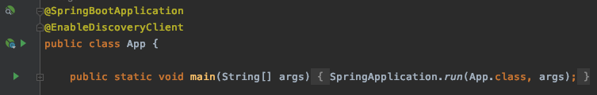 
### App 2
App 1의 실행 설정을 복사하여 포트만 바꿔서 실행.  

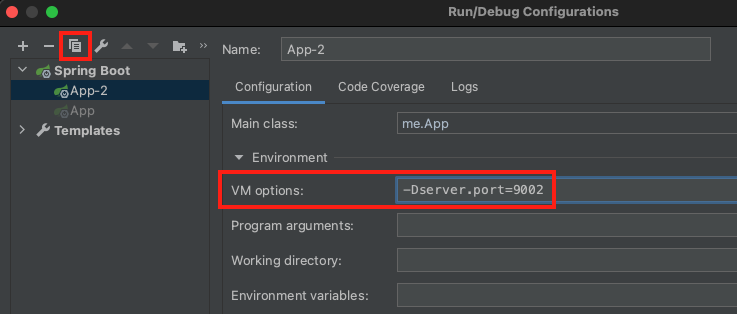 
### App 3 
인텔리제이에서 아래와 같이 mvn 명령으로 실행.  

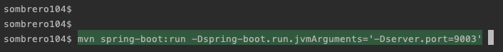 
~~~
mvn spring-boot:run -Dspring-boot.run.jvmArguments='-Dserver.port=9003'
~~~

### App 4
터미널에서 아래와 같이 빌드하여 java 명령으로 직접 실행.  

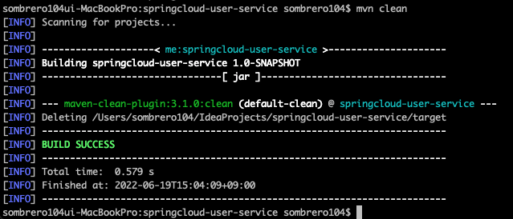 
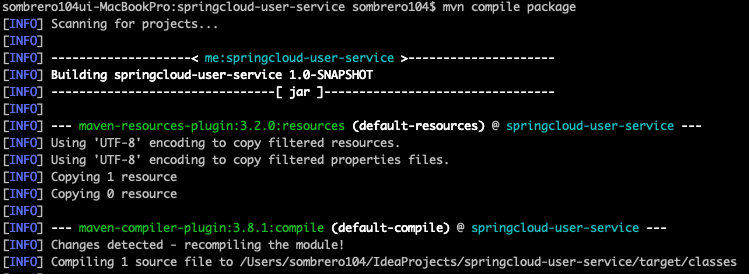 
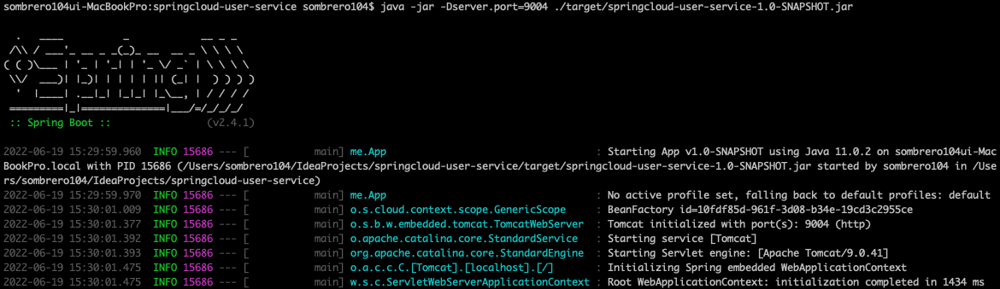 
~~~
java -jar -Dserver.port=9004 ./target/springcloud-user-service-1.0-SNAPSHOT.jar
~~~ 

### 4개의 App 실행 후 
Eureka Server의 Status에서 위에서 실행한 App들이 등록된 것을 확인할 수 있다.  

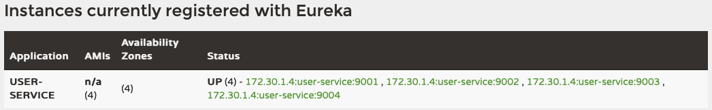 
  

## 랜덤 포트로 App 실행하기
위와 같이 일일이 포트를 설정하여 App을 실행하지 않고  
App이 실행될 때마다 랜덤 포트를 사용하도록 할 수 있다.  
아래와 같이 application.yml에서 server.port를 0번으로 설정하면  
실행할 때마다 랜덤 포트로 실행하게 된다.  

#### [application.yml]
~~~
server:
  port: 0 
... 
~~~ 

그런데 App을 여러 개 띄워도 Eureka Server에서 확인해 보면 1개의 서비스만 나오게 된다.  

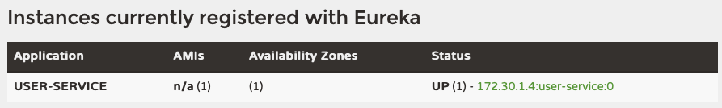 

application.yml에서 설정한 포트 번호(0)와 애플리케이션 이름이 같기 때문인데  
아래와 같이 instance-id를 설정해 주면 해결된다.  
~~~
server:
  port: 0
...
eureka:
  instance:
    instance-id: ${spring.cloud.client.hostname}:${spring.application.instance_id:${random.value}}
... 
~~~
 

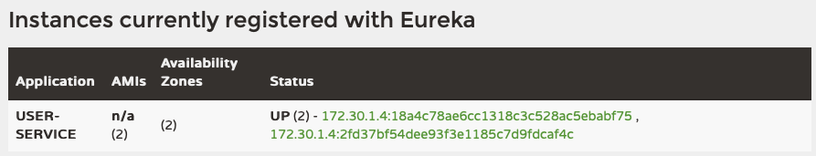 
    

# 샘플 프로젝트 구성 
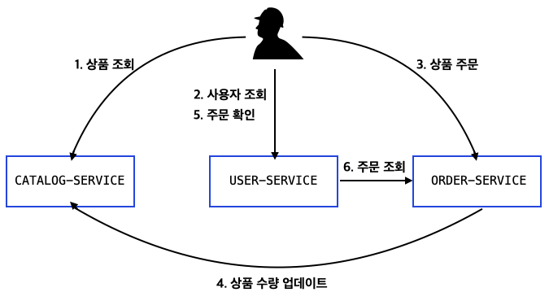 
 

## user-service 요청 예시 
### 사용자 등록 
- Method: POST
- URL: http://127.0.0.1:8000/user-service/users
- Body: 
~~~
{
    "email": "smith2@email.com",
    "name": "smith2",
    "pwd": "smith111"
}
~~~
- Response:
~~~
{
    "email": "smith2@email.com",
    "name": "smith2",
    "userId": "2964d7a2-d565-405b-88b6-8bea40a2ee82"
}
~~~

### 로그인 
- Method: POST
- URL: http://127.0.0.1:8000/user-service/login
- Body: 
~~~
{
    "email": "smith2@email.com",
    "password": "smith111"
}
~~~
- Response Headers:  
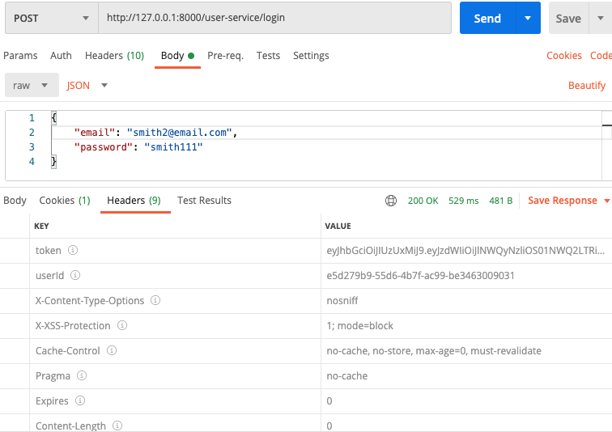 
 

## config-service 연동  

#### [pom.xml]
~~~
<dependency>
    <groupId>org.springframework.cloud</groupId>
    <artifactId>spring-cloud-starter-config</artifactId>
</dependency>
<dependency>
    <groupId>org.springframework.cloud</groupId>
    <artifactId>spring-cloud-starter-bootstrap</artifactId>
</dependency>
~~~

#### [bootstrap.yml]
~~~
spring:
  cloud:
    config:
      uri: http://127.0.0.1:8888
      name: ecommerce
~~~

#### [실행 결과 Bootstrap 로그]
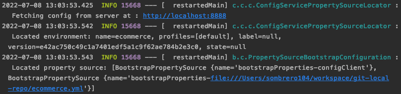 

#### [실행 결과 Config 정보 확인]
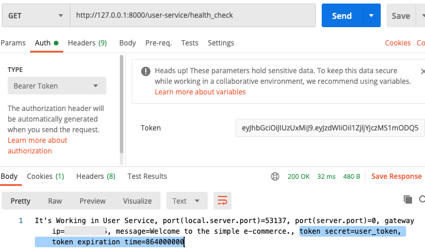 
     

# 마이크로서비스 간 통신 방식 
- Synchronous HTTP communication 
- Asynchronous communication over AMQP
 

## RestTemplate 을 사용하는 방식 
#### [App.java]
~~~
@Bean
public RestTemplate getRestTemplate() {
    return new RestTemplate();
}
~~~
#### [UserServiceImpl.java]
~~~
String orderUrl = String.format(env.getProperty("order_service.url"), userId);
ResponseEntity<List<ResponseOrder>> orderListResponse =
        restTemplate.exchange(orderUrl, HttpMethod.GET, null,
                new ParameterizedTypeReference<List<ResponseOrder>>() {
                });
List<ResponseOrder> ordersList = orderListResponse.getBody();
~~~
#### [user-service.yml]
~~~
order_service:
  url: http://127.0.0.1:8000/order-service/%s/orders
       # => order-service의 @GetMapping("/{userId}/orders")로 요청 
~~~
#### [user-service - /users/{userId} 요청 결과] 
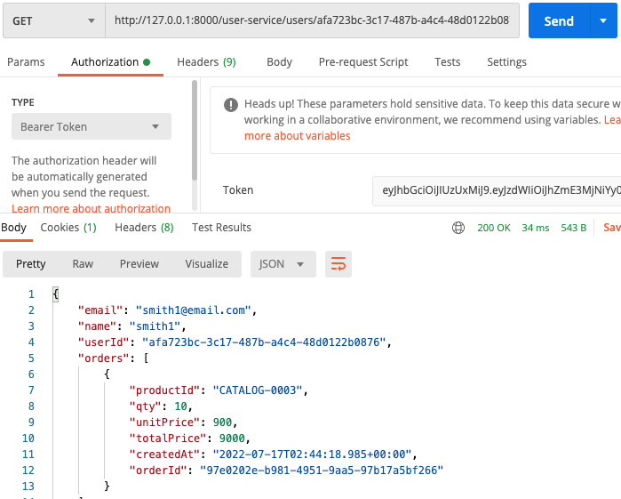 
 

#### 유레카에 등록된 마이크로서비스 이름으로 변경. 
~~~
http://127.0.0.1:8000/order-service/%s/orders
    => http://order-service/order-service/%s/orders
~~~
~~~
@Bean
@LoadBalanced   // 마이크로서비스 이름으로 호출 가능하도록 @LoadBalanced 추가. 
public RestTemplate getRestTemplate() {
    return new RestTemplate();
}
~~~
 

## FeignClient 를 사용하는 방식 
- REST Call을 추상화 한 Spring Cloud Netflix 라이브러리 
- RestTemplate 보다 직관적이고 간단하게 사용할 수 있음. 
- 호출하려는 HTTP Endpoint 에 대한 Interface 를 생성.
- @FeignClient 선언
- Load balanced 지원 

#### [pom.xml] 
~~~
<dependency>
    <groupId>org.springframework.cloud</groupId>
    <artifactId>spring-cloud-starter-openfeign</artifactId>
</dependency>
~~~ 
#### [App.java] 
~~~
@SpringBootApplication
@EnableDiscoveryClient
@EnableFeignClients // FeignClient 사용할 수 있도록 추가. 
public class App {
~~~
#### [@FeignClient 인터페이스 생성]
~~~
@FeignClient(name = "order-service")
public interface OrderServiceClient {

    @GetMapping("/order-service/{userId}/orders")
    List<ResponseOrder> getOrders(@PathVariable String userId);

}
~~~
#### [UserServiceImpl.java]
~~~
List<ResponseOrder> ordersList = null;
try {
    ordersList = orderServiceClient.getOrders(userId);
} catch (FeignException ex) {
    log.error(ex.getMessage());
}
~~~
 

### FeignClient 에서 로그 사용
아래와 같이 설정만 해줘도 FeignClient 인터페이스 사용 시 로그가 남는다.  
#### [application.yml]
~~~
logging:
  level:
    me.client: debug
~~~ 
#### [App.java]
~~~
@Bean
public Logger.Level feignLoggerLevel() {
    return Logger.Level.FULL;
}
~~~

#### [요청 결과]

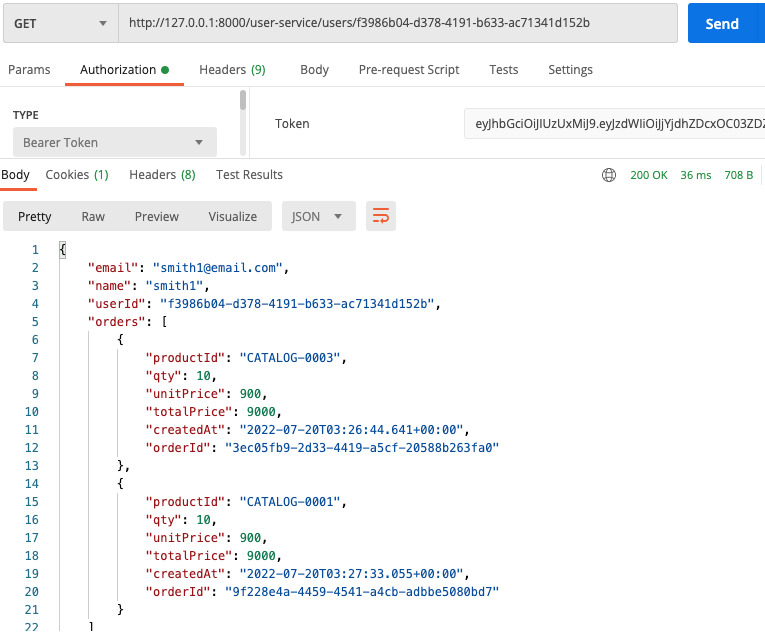 

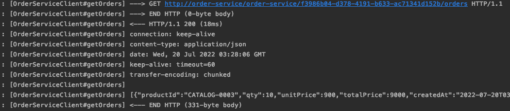 
 

### ErrorDecoder 를 이용한 예외 처리 
FeignClient 사용 시 발생한 예외를 분기별로 처리 가능하게 함.  
ErrorDecoder 를 상속받는 클래스를 만들어서 빈으로 등록하거나 @Component 로 설정한다.  
이렇게 등록하게 되면 FeignClient 인터페이스 호출 시 에러 처리를 해주지 않아도 된다.  

#### [FeignErrorDecoder.java]
~~~
@Component
public class FeignErrorDecoder implements ErrorDecoder {
    /*Environment env;

    @Autowired
    public FeignErrorDecoder(Environment env) {
        this.env = env;
    }*/

    @Override
    public Exception decode(String methodKey, Response response) {
        switch(response.status()) {
            case 400:
                break;
            case 404:
                if (methodKey.contains("getOrders")) {
                    return new ResponseStatusException(HttpStatus.valueOf(response.status()),
                            "User's orders is empty.");
                            // env.getProperty("order_service.exception.orders_is_empty"));
                            
                }
                break;
            default:
                return new Exception(response.reason());
        }

        return null;
    }
}
~~~
#### [UserServiceImpl.java]
~~~
// FeignClient 사용 시 예외처리를 해주지 않아도 됨. 
List<ResponseOrder> ordersList = orderServiceClient.getOrders(userId);
~~~
#### [요청 결과]
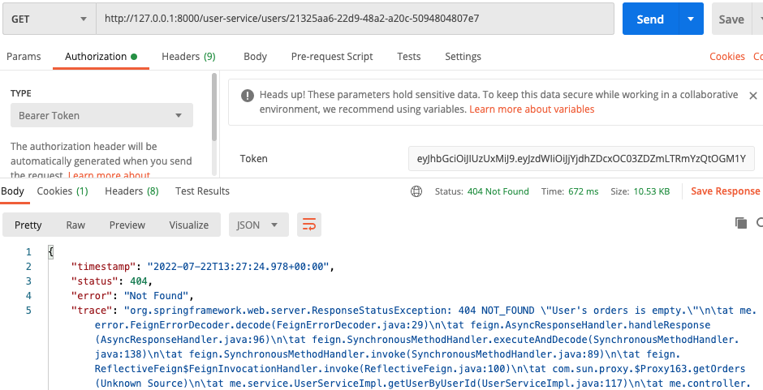 
    

# Microservice 장애 처리 
## Circuit Breaker 패턴 
- https://martinfowler.com/bliki/CircuitBreaker.html
- 장애가 발생하는 서비스에 반복적인 호출이 되지 못하게 차단하는 패턴.
    - 문제가 있는 마이크로서비스로의 트래픽을 차단하여 전체 서비스가 느려지거나 중단되는 것을 미리 방지. 
- 특정 서비스가 정상적으로 동작하지 않을 경우 다른 기능으로 대체 수행. (장애 회피)
    - 특정 서비스가 정상적으로 동작하지 않더라도 해당 서비스만큼은 정상적으로 동작할 수 있도록 함. 
- Circuit Breaker 의 Open/Closed
    - Open (Circuit Breaker 가 열려있는 경우)
        - 특정 수치 만큼 반복적으로 정상적인 서비스가 되지 않을 경우 Circuit Breaker 가 열림. 
        - 요청을 더이상 전달하지 않고 Circuit Breaker 자체적으로 우회할 수 있는 값을 리턴. 
    - Closed (Circuit Breaker 가 닫혀있는 경우)
        - 서비스를 정상적으로 이용할 수 있는 경우.  

## Resilience4J 적용 
Circuit Breaker 기능을 하는 모듈 라이브러리를 제공한다.  
(이 외에도 Resilience4J 에는 Bulkhead, RateLimiter, Retry, TimeLimiter, Cache 등의 모듈 라이브러리들이 있다.)  

#### [pom.xml] 
~~~
<dependency>
    <groupId>org.springframework.cloud</groupId>
    <artifactId>spring-cloud-starter-circuitbreaker-resilience4j</artifactId>
</dependency>
~~~
#### [UserServiceImpl.java] 
~~~
@Service
@Slf4j
public class UserServiceImpl implements UserService {
    CircuitBreakerFactory circuitBreakerFactory;
    @Override
    public UserDto getUserByUserId(String userId) {
        ...
        /** CircuitBreaker 사용하는 방법 **/
        log.info("Before call orders microservice");
        CircuitBreaker circuitBreaker = circuitBreakerFactory.create("circuitbreaker");
        List<ResponseOrder> ordersList = circuitBreaker.run(() -> orderServiceClient.getOrders(userId),
                throwable -> new ArrayList<>()); // getOrders() 요청 시 문제가 생겼을 경우에 new ArrayList<>() 반환.
        log.info("After called orders microservice");
        ...
    }
}
~~~
#### [Resilience4JConfig.java]
~~~
@Configuration
public class Resilience4JConfig {
    @Bean
    public Customizer<Resilience4JCircuitBreakerFactory> globalCustomConfiguration() {
        CircuitBreakerConfig circuitBreakerConfig = CircuitBreakerConfig.custom()
                .failureRateThreshold(4)
                    // Failure Rate Threshold(실패율 임계값): CircuitBreaker 를 언제 열 것인지를 결정하는 수치. (percentage 값)
                    // 디폴트는 50%. (10번 중 5번 실패 시 CircuitBreaker 가 열림.)
                .waitDurationInOpenState(Duration.ofMillis(1000))
                    // CircuitBreaker 를 open 한 상태를 유지하는 지속 시간. (문제가 생긴 서비스를 요청하지 않는 시간.)
                    // 디폴트는 60초. (60초 이후에 다시 문제가 있었던 서비스로 요청을 시도해봄. half-open 상태.)
                .slidingWindowType(CircuitBreakerConfig.SlidingWindowType.COUNT_BASED)
                    // 정상적으로 서비스를 사용할 수 있을 때 CircuitBreaker 가 close 되고, 지금까지 호출했었던 결과값을 기록하게 되는데
                    // 저장할 때 카운트(횟수) 기반 혹은 시간 기반으로 저장할 것인지를 설정. 디폴트는 카운트 기반.
                .slidingWindowSize(2) // 카운트 기반일 경우에는 횟수, 시간 기반일 경우에는 시간 설정.
                .build();

        TimeLimiterConfig timeLimiterConfig = TimeLimiterConfig.custom()
                .timeoutDuration(Duration.ofSeconds(4))
                    // Timeout Duration: 디폴트 1초. (1초 동안 응답이 없을 경우 문제로 간주.)
                .build();

        return factory -> factory.configureDefault(id -> new Resilience4JConfigBuilder(id)
                .timeLimiterConfig(timeLimiterConfig)
                .circuitBreakerConfig(circuitBreakerConfig)
                .build()
        );
    }
}
~~~
#### [테스트 결과]
order-service 를 중지한 후 user-service 에서 사용자의 주문 정보를 조회하면  
아래와 같이 에러로 반환되지 않고 주문 정보가 비어있는 값으로 반환되게 된다.  

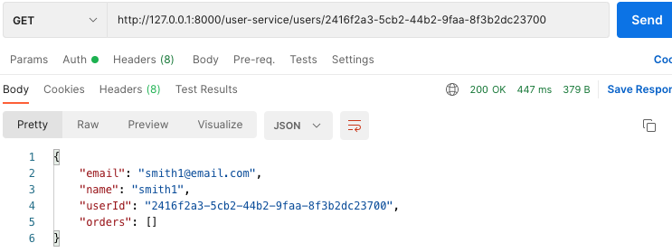 

요청 결과는 정상적으로 나오고 user-service 로그에서는 에러 로그가 발생한 것을 확인할 수 있다.  

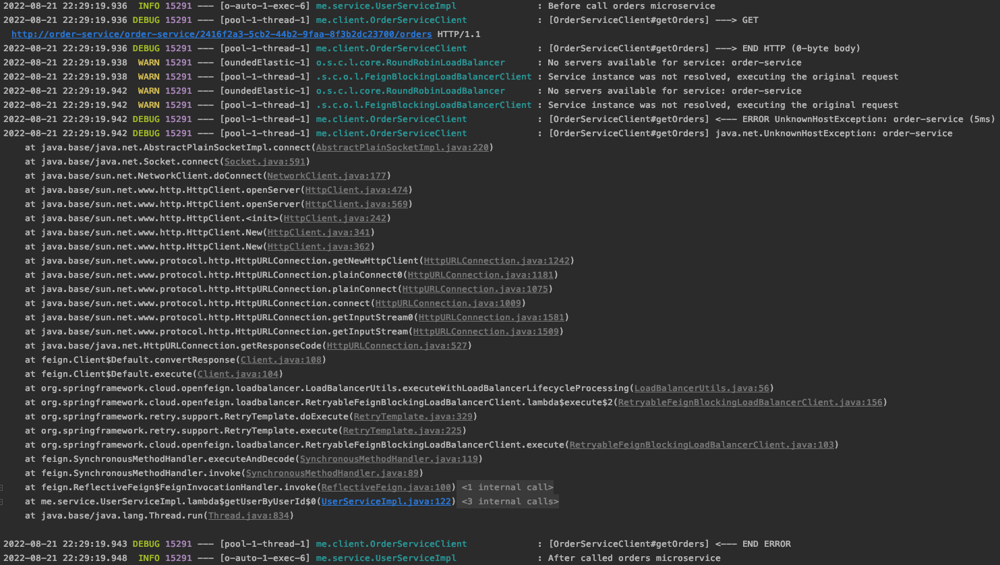 
    

# Microservice 분산 추적 
## Zipkin
- https://zipkin.io
- Twitter 에서 사용하는 분산 환경의 Timing 데이터 수집, 추적 시스템을 오픈 소스로 만듦. 
- Google 의 Dapper 서비스에서 시작이 되었으며, 분산 환경에서의 시스템 병목 현상 파악.
    - (어떤 서비스가 어떤 서비스를 요청했고, 얼마나 걸렸는지..) 
- Zipkin 은 Collector, Query Service, Database, WebUI 로 구성되어 있다. 
- 서비스를 호출하거나 서비스에서 다른 서비스를 호출할 때의 모든 정보를 Zipkin 에 전달한다. 
- Span
    - 하나의 요청에 사용되는 작업의 단위.
    - Span 에는 64 bit unique ID 가 부여된다. 
- Trace
    - 트리 구조로 이루어진 Span Set.
    - 하나의 요청에 대해 같은 Trace ID 가지고,  
    여러개로 나눠진 Span ID 를 이용해서 사용자가 요청했던 값이 어느 곳에서 진행되고 있는지 확인할 수 있다.
    
        > 예를 들어, 사용자가 주문을 할 경우 주문 요청에 대한 Trace ID 가 하나 주어지고,  
        > user-service -> order-service -> catalog-service 와 같이 각각의 요청들에는 Span ID 가 주어진다. 

## Spring Cloud Sleuth 
- 스프링 부트 애플리케이션을 Zipkin 과 연동시켜 주는 역할을 함. 
- 요청 값에 따른 Trace ID, Span ID 부여.
- Trace ID, Span ID 를 로그에 추가 가능.
    - Servlet Filter, Rest Template, Scheduled Actions, Message Channels, Feign Client  
    와 연동해서 Zipkin 으로 로그 데이터를 전달하는 역할을 함. 

### Zipkin 설치 
zipkin.jar 파일을 다운로드 후 실행. 
~~~
curl -sSL https://zipkin.io/quickstart.sh | bash -s
java -jar zipkin.jar
~~~
정상적으로 실행이 되면 아래와 같이 Zipkin 대시보드 역할을 하는 웹 UI 의 주소가 나온다.  

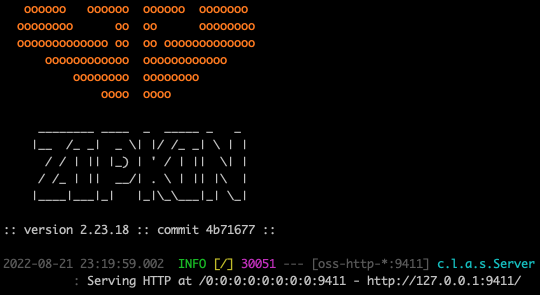 

    
